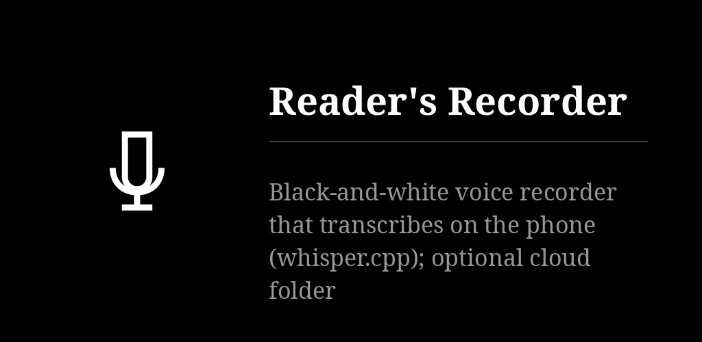

# Reader's Recorder

One tap records a memo, a lecture or a conversation, screen off included. The phone itself
writes the transcript ([whisper.cpp](https://github.com/ggerganov/whisper.cpp)), evens the
loudness and can list the main points (beta) — nothing leaves it. Optional export to your own
WebDAV folder. Text only, six languages; one of the
[Reader's](https://github.com/funkypitt/readers-launcher) apps.

## Key points

* **● record** is the bottom row of the list; the widget and the Reader's Launcher tile do the
  same in one tap. On the recording page: the kind (memo, lecture, conversation), pause, ■ stop.
* A recording's page plays it (tap the rule to seek) and shows the transcript. Long press on a
  row: rename (titles are otherwise automatic), share the audio or the transcript, delete, or
  select several.
* Transcription runs on the phone: normal (Whisper small, 190 MB, the default) or high quality,
  much slower (large-v3-turbo, 574 MB). The model is fetched once. The language is the phone's,
  English, or detected.
* A cleaned listening copy is made beside the original: 60 Hz high-pass, −19 LUFS, no compression.
* Main points (beta, off by default): a model of about 2 GB, fetched on the first tap; a phone
  with less than about 6 GB of memory is refused the option.
* Cloud folder (optional, WebDAV: kDrive, Nextcloud…), set up in three questions. It is an
  export only: recording, transcript, cleaned copy and points go up, nothing comes back.
* Two widgets for any launcher (record, listen) and two Reader's Launcher tiles. Models are
  shared with Reader's Audio Player: nothing is downloaded twice.
* Permissions: microphone, notifications, and the network for the model download and the
  cloud folder. No account.

More detail: [docs/NOTES.md](docs/NOTES.md) — internals, the private build and its worker.

## Install

From the F-Droid repo `https://funkypitt.github.io/fdroid-repo/repo`, or the APK of the
[latest release](https://github.com/funkypitt/readers-recorder/releases/latest).

## Build

```
git clone --recursive https://github.com/funkypitt/readers-recorder.git   # or: git submodule update --init
export JAVA_HOME=/path/to/jdk-21
./gradlew assemblePubliqueDebug
```

minSdk 26, targetSdk 34. `speech/` is the
[readers-speech](https://github.com/funkypitt/readers-speech) submodule. Two flavours: `publique`
(F-Droid) and `prive` (adds the workstation worker; same application id, version code 500
ahead). Keep `ndkVersion` in `app/build.gradle.kts`, or the native libraries ship unstripped.

## Crédits / Credits

© 2026 Pierre Gallaz. Développé avec [Claude Code](https://claude.com/claude-code) (Anthropic).
Licence MIT, voir `LICENSE`.

© 2026 Pierre Gallaz. Developed with [Claude Code](https://claude.com/claude-code) (Anthropic).
MIT licence, see `LICENSE`.
